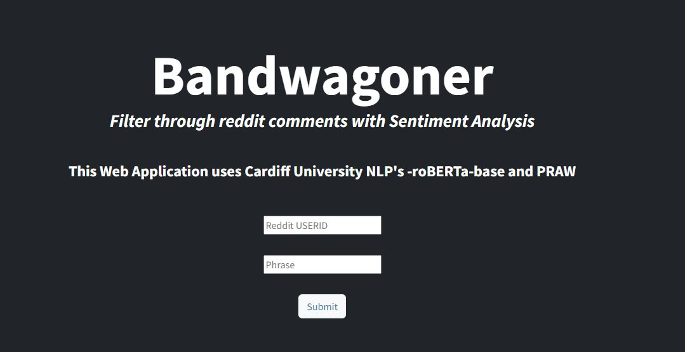
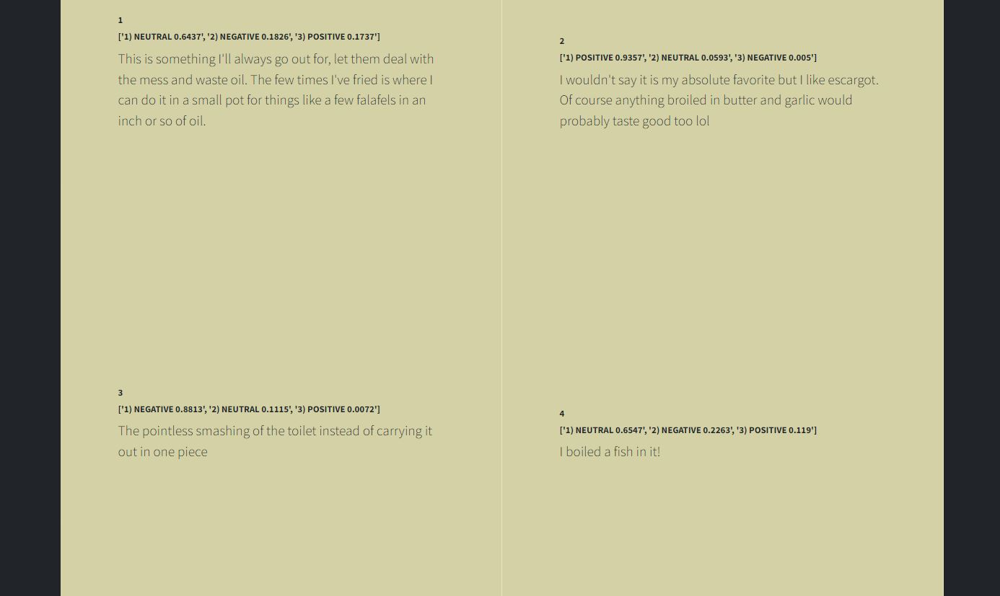
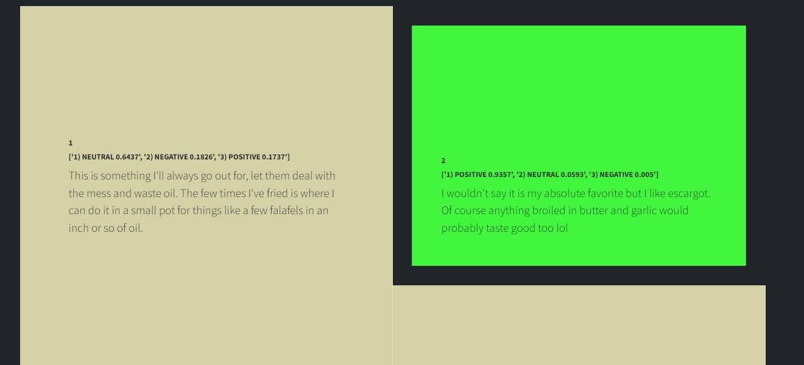
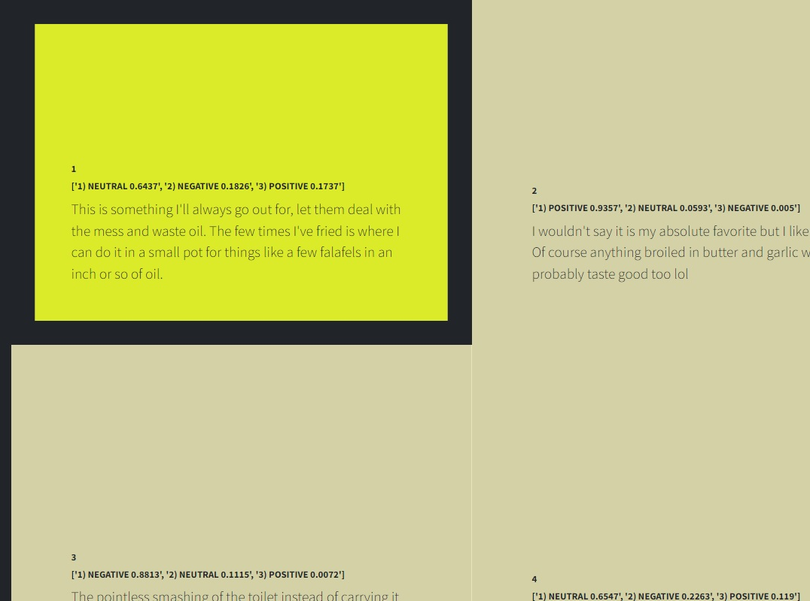
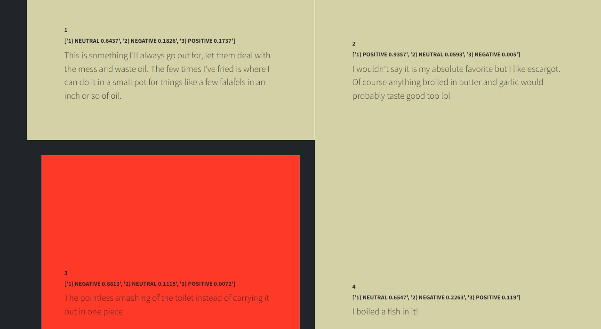

# Bandwagoner (title)
## Search a reddit user's comments across all subreddits with Sentiment Analysis
## Skills Applied

- Model View Controller Paradigm
- Utilization of Neural Network and AI
- API calls
- Function testing, performance testing, error checking
- Built with Python, HTML, and CSS, through Flask and Bootstrap.

## Example Images

## Enter a reddit Username and a Phrase to search for
## The sentiment of each comment will be analyzed by a neural network
- will be represented graphically and in text

## Sleek list of comments returned

## Mouseover Utilizes Neural Network Results to  Correspond to Sentiment/Mood of the Author
- exact sentiment data also shown in text format
## Green for Positive

## Yellow for Neutral

## Red for Negative

## How to use
- Fork the repo
- Use pip install -r requirements.txt
- create praw.ini with your client_id, client_secret, and user_agent in your working directory (wherever your virtual environment is, if using VScode)

## Model View Controller
### Model
- API_test.py and SA_test.py serve as the model that manipulates and utilizes the data from API call
- API_test.py makes calls to the Reddit API and organizes the data for usage in this application
- SA_test.py utilizes Cardiff University's implementation of a RoBERTa model (a variation of the BERT model utilizing Transformer architecture)
### View
- The index.html HTML rendered through Flask in app.py serves as the view
### Controller
- app.py serves as the controller which passes input to the model
- It passes user input from the view(index.html) to functions in the model (SA_test.py, API_test.py)

## Citations
- CardiffNLP (2021). Twitter RoBERTa Base Sentiment Model. Hugging Face's Transformers. Available at: https://huggingface.co/cardiffnlp/twitter-roberta-base-sentiment-latest. 
- Reddit API (PRAW). Version 7.4.0. Available from https://praw.readthedocs.io/en/stable/
- Read about the transformer architecture:
- Vaswani, A., Shazeer, N., Parmar, N., Uszkoreit, J., Jones, L., Gomez, A. N., Kaiser, Ł., & Polosukhin, I. (2017). Attention is all you need. In Advances in neural information processing systems (pp. 5998-6008).
-  Read about BERT:
-  Devlin, J., Chang, M. W., Lee, K., & Toutanova, K. (2018). BERT: Pre-training of Deep Bidirectional Transformers for Language Understanding. In Proceedings of the 2019 Conference on Empirical Methods in Natural Language Processing (EMNLP) (pp. 4171-4186).
-  Read about RoBERTa:
-  Liu, Y., Ott, M., Goyal, N., Du, J., Joshi, M., Chen, D., ... & Stoyanov, V. (2019). RoBERTa: A robustly optimized BERT pretraining approach. arXiv preprint arXiv:1907.11692.

